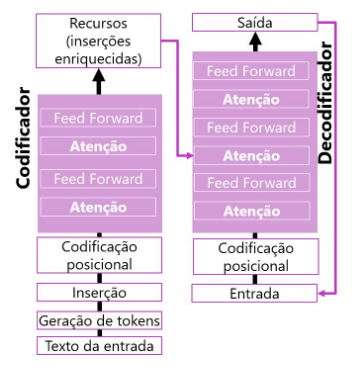

<h1>
     
     
         Fundamentos da IA Generativa 
</h1>

# O que é IA generativa?
- Inteligência Artificial que imita o comportamento humano usando aprendizado de máquina para interagir com o ambiente e executar tarefas sem instruções explícitas sobre o que produzir;
- A IA generativa descreve uma categoria de recursos da IA que criam conteúdo original;
- Os aplicativos de IA generativa recebem informações de linguagem natural e retornam respostas apropriadas em uma variedade de formatos, como linguagem natural, imagens ou código

## Geração de linguagem natural
- Para gerar uma resposta em linguagem natural, você pode enviar uma solicitação como "Dê-me três ideias para um café da manhã saudável, incluindo pimentões".
- E a IA Generativa gerará respostas
- O exemplo mais popular é o próprio ChatGPT

## Geração de imagem
- Algumas aplicações generativas de IA podem interpretar uma solicitação de linguagem natural e gerar uma imagem;
- Exemplo: "Crie uma imagem de um elefante comendo um hambúrguer"

## Geração de código
- Alguns aplicativos generativos de IA são projetados para ajudar os desenvolvedores de software a escrever código;
- Exemplo: Mostre-me como codificar um jogo da velha com Python" 

# Modelos de Linguagem Grande
- Os aplicativos de IA generativa são alimentados por grandes modelos de linguagem (LLMs), que são um tipo especializado de modelo de aprendizado de máquina que você pode usar para executar tarefas de processamento de linguagem natural (PNL), incluindo:
    - Determinar o sentimento ou classificar o texto em linguagem natural.
    - Resumindo o texto.
    - Comparando múltiplas fontes de texto quanto à similaridade semântica.
    - Gerando nova linguagem natural.

## Modelos de transformadores
- Os modelos transformadores são treinados com grandes volumes de texto, permitindo-lhes representar as relações semânticas entre palavras e usar essas relações para determinar prováveis sequências de texto que façam sentido.
- A arquitetura do modelo do transformador consiste em dois componentes ou blocos :
    - Um bloco codificador que cria representações semânticas do vocabulário de treinamento.
    - Um bloco decodificador que gera novas sequências de linguagem.

## Transformador
- A primeira etapa no treinamento de um modelo de transformador é decompor o texto de treinamento em tokens – em outras palavras, identificar cada valor de texto exclusivo
- Incerções (valores de vetor com várias dimensões) são atribuídas aos tokens
- As camadas de ateção examinam cada token por vez e determinam valores incorporados que refletem os relacionamentos semânticos entre os tokens. 
- No, decodificador, essas relações são usadas para prever a sequência mais provável de tokens

## Tokenização
- A primeira etapa no treinamento de um modelo de transformador é decompor o texto de treinamento em tokens
- **Exemplo:** Eu ouvi um cachorro latir alto para um gato.

        "Eu" = 1
        "ouvi" = 2
        "um" = 3 
        "cachorro" = 4
        "latir" = 5
        "alto" = 6 
        "para" = 7
        "gato" = 8

- A frase é representada com os tokens: [1 2 3 4 5 6 7 3 8]
- Observe que "um" é tokenizado com 3 apenas uma vez
- "Eu ouvi um gato" ➜ [1 2 3 8]

## Inserções
- As relações entre tokens são capturadas como vetores, conhecidos como inserções. 

## Atenção 
- Capture a força das relções entre tokens usando a técnica de atenção
- **Exemplo:**
    - Meta: Prever o token após "cachorro". 
    - Representante "Ouvi um cachorro" como vetores. 
    - Atribua mais peso a "ouvi" e "cachorro"
    - Vários tokens possíveis podem vir depois de cachorro
    - O token mais próvavel é adicionado á sequência, nesse caso, "latir".

## Copilotos
- Os copilotos são frequentimente integrados a outros aplicativos e fornecem uma maneira para os usuários obterem ajuda com tarefas comuns a partir de um modelo generativo de IA
- Os desenvolvedores podem criar copilotos que enviam prompts para grandes modelos de linguagem e geram conteúdo para uso em aplicativos
- Os usuários empresariais podem usar copilotos para aumentar sua produtividade e criatividae com conteúdo gerado por IA. 
    - **Exemplos:**
    - Navegador Microsoft Edge
    - Microsoft Bing
    - GitHub Copilot

## Engenharia de Prompts
- O termo engenharia de prompt descreve o processo de aprimoramento de prompts
- Os desenvolvedores que projetam aplicativos podem aprimorar a qualidade das respostas da IA generativa usando linguagem direta, mensagens do sistema, exemplos e/ou dados de fundamentação

|       | Descrição | Exemplo |
|-------| ----------| --------|
|Linguagem direta | Você pode obter conclusões mais úteis sendo explícito sobre o tipo de resposta que deseja | **"Crie uma lista** de 10 coisas para fazer em Edimburgo durante o mês de agosto"|
| Mensagens do Sistema | Descerva como o chat deve funcionar | "Você é um assistente **útil** que **responde de maneira alegre e** amigável". |
| Fornecer exemplos | As LLMs geralmente dão suporte ao aprendizado zero-shot no qual as respostas podem ser geradas sem exemplos anteriores. No entanto, você também pode fornecer algumas respostas de exemplo, conhecidas como aprendizado de poucas capturas. | "Visite o castelo pela manhã, antes que as multidões cheguem". |
| Dados Básicos | Os prompts podem incluir dados de fundamentação para fornecer contexto. | Incluindo **o texto de email** com a mensagem "Resumir meu email".|

## IA Generativa Responsável
- As quatro fases do processo para desenvolvel e implementar um plano de IA responsável são:
    - Identificar, Medida, Mitigar e Operar

- **Identificar:** Possíveis danos relevamtes para a solução planejada. 
- **Medida:** A presença desses danos nas saídas geradas pela solução. 
- **Mitigar:** Os danos em várias camadas em sua solução para minimizar a presença e impacto deles.
- **Operar:** A solução com responsabilidade definindo e seguindo um plano de implantação e de preparação operacional. 
