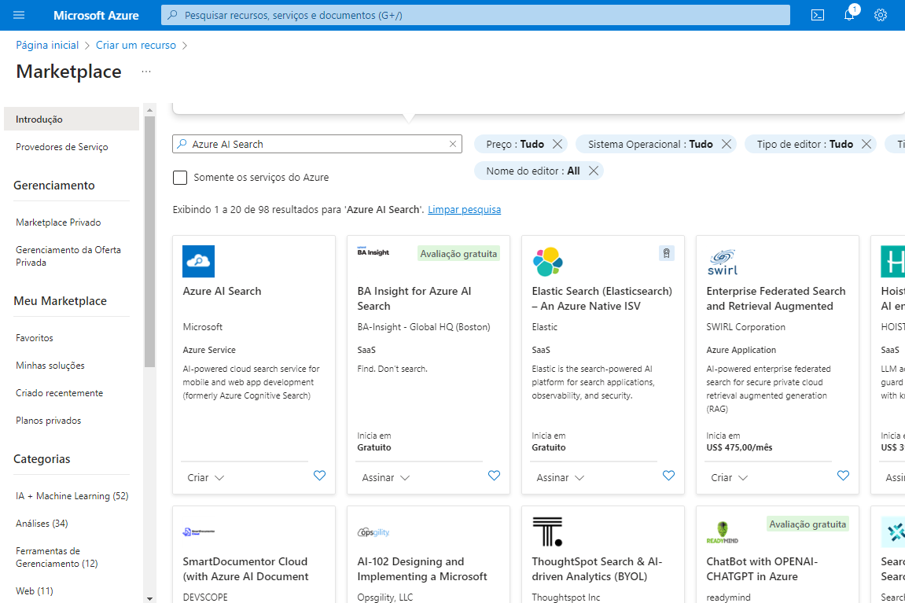
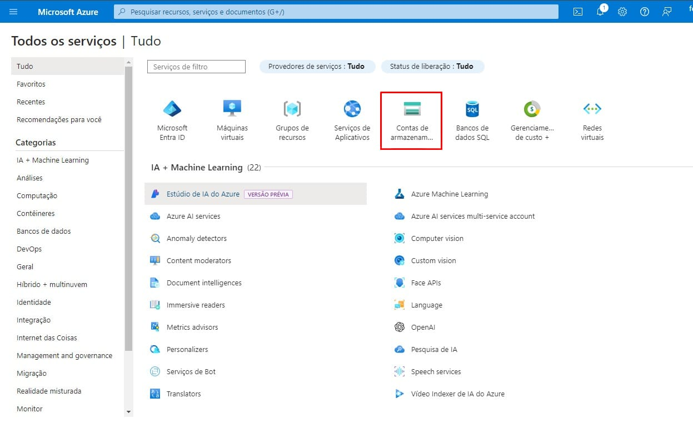

<h1>
     
     
    Azure Cognitive Search: Utilizando AI Search para indexação e consulta de Dados
 
</h1>

## Case do Projeto:
-  Você trabalha para a Fourth Coffee, uma rede nacional de cafés. Você foi solicitado a ajudar a criar uma **solução de mineração de conhecimento** que facilite a busca de insights sobre as experiências dos clientes. Você decide criar um índice do Azure AI Search usando dados extraídos de avaliações de clientes.

   
   Primeiramente, vamos usar o Azure AI Search

- Após configurar e implementar o Azure AI Search, usei tammbém o Azure AI services;

Azure AI Services

- Depois tem que criar a conta de armazenamento e permirtir o Acesso Anônimo ao Blob;

- Após isso, cria-se um container e a importação e indexação dos dados;

- Depois disso, consultei o índice clicando o Explorador de pesquisa;
- Alterei para a visualização em JSON

- No campo do editor de consultas JSON , copiei e colei:
      
      {
         "search": "*",
         "count": true
      }